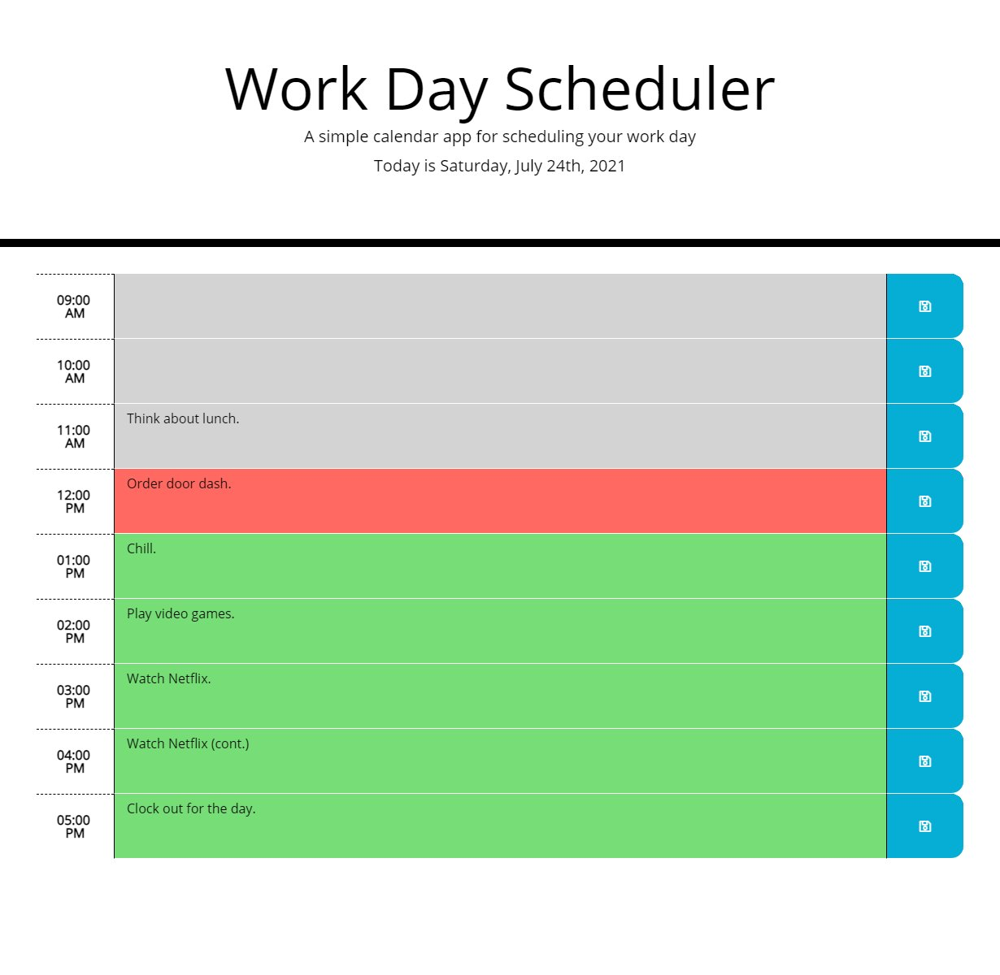

# Work Day Scheduler Sample Webapp

## Description
This is a sample web application for a work day schedule using Moment.js. The application supports the usage of LocalStorage for saving the schedule between page refreshes, and will update on the hour. This assumes a typical work schedule of 9 to 5. Visit the deployed application [here](https://hsengu.github.io/workday-scheduler).

## Built With
- HTML
- CSS
- JavaScript
- Moment.js
- JQuery
- Bootstrap

## Screenshot

## Contributors
### Hok S. Uy
- JavaScript
- CSS

### Coding Boot Camp
- Starter HTML
- Starter CSS